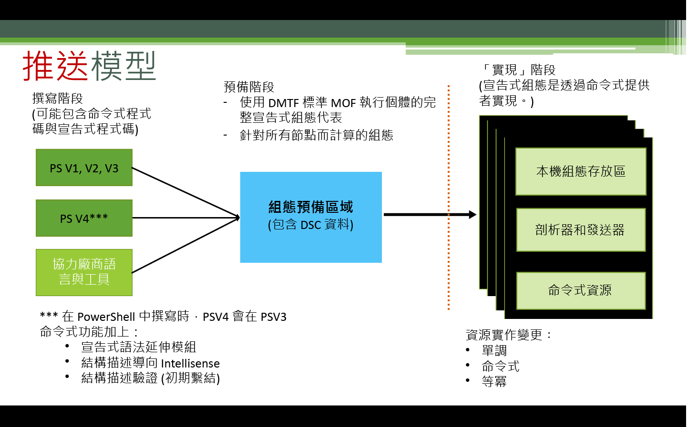
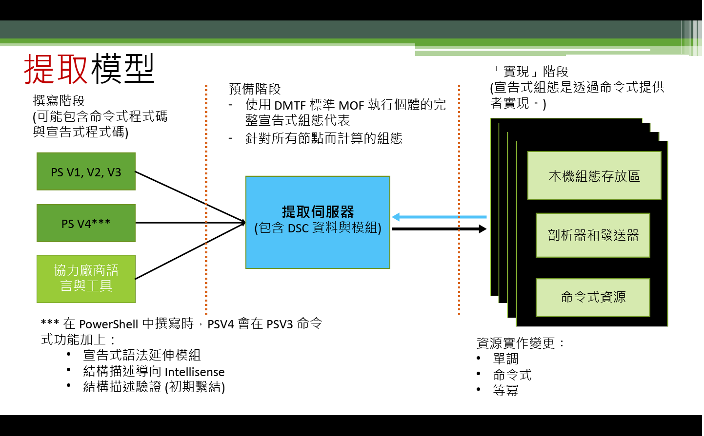

# 施行設定

>適用於：Windows PowerShell 4.0、Windows PowerShell 5.0

PowerShell 預期狀態設定 (DSC) 設定有兩種施行方式：Push 模式和 Pull 模式。

## Push 模式

Push 模式指的是使用者呼叫 [Start-DscConfiguration](https://technet.microsoft.com/en-us/library/dn521623.aspx) Cmdlet，將設定積極套用至目標節點。

建立及編譯設定後，您可以呼叫 [Start-DscConfiguration](https://technet.microsoft.com/en-us/library/dn521623.aspx) Cmdlet，設定 MOF 所在路徑之 Cmdlet 的 -Path 參數，以 Push 模式施行設定。 例如，如果設定 MOF 位於 `C:\DSC\Configurations\localhost.mof`，您可以使用下列命令將它套用到本機電腦：
`Start-DscConfiguration -Path 'C:\DSC\Configurations'`

> __注意__：DSC 預設將設定當做背景工作執行。 若要以互動方式執行設定，請呼叫 [Start-DscConfiguration](https://technet.microsoft.com/en-us/library/dn521623.aspx) 配以 __-Wait__ 參數。

在更大的部署解決方案內，雲端部署引擎通常會利用 Pull 模式。  例如，Microsoft Azure 為虛擬機器提供 [DSC 擴充功能](https://azure.microsoft.com/en-us/documentation/articles/virtual-machines-extensions-features/)。  這提供您在封存檔案中包含設定指令碼和所有必要 DSC 模組的選項，在虛擬機器內，這個封存檔案是當做部署的一部分來執行和擷取。  

## Pull 模式

在 Pull 模式中，提取用戶端會設定成從遠端的提取伺服器取得其所需的狀態設定。 同樣地，提取伺服器已設為 DSC 服務主機，佈建了提取用戶端所需要的設定和資源。
每個提取用戶端都有排定的工作，對節點設定執行定期的相容性檢查。 事件第一次觸發時，會讓提取用戶端的本機設定管理員 (LCM) 驗證設定。 如果提取用戶端設定為所需，就不會發生任何事。 否則，LCM 就會要求提取伺服器取得指定的設定。 如果提取伺服器上有這個設定，而且它通過了初始驗證檢查，設定就會傳輸到提取用戶端，LCM 會在這裡執行它。

如需部署內部部署 DSC 提取伺服器的詳細資訊，請參閱＜DSC 提取伺服器設定和規劃指南＞。

如果想要利用線上服務裝載提取伺服器功能，請參閱 [Azure 自動化 DSC](https://azure.microsoft.com/en-us/documentation/articles/automation-dsc-overview/) 服務。

下列主題說明如何設定提取伺服器和用戶端：

- [設定 Web 提取伺服器](pullServer.md)
- [設定 SMB 提取伺服器](pullServerSMB.md)
- [設定提取用戶端](pullClientConfigID.md)<!--HONumber=Feb16_HO4-->
