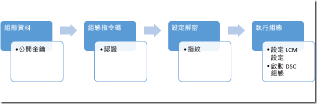

# 保護 MOF 檔案

>適用於：Windows PowerShell 4.0、Windows PowerShell 5.0

DSC 將具有相關資訊的 MOF 檔案傳送至每個節點，告訴本機設定管理員 (LCM) 實作所需設定的目標節點，它們應有的 
設定的初始化參數。 因為這個檔案包含設定的詳細資料，所以安全防護很重要。 若要這樣做，您可以設定 LCM 檢查 
使用者認證。 本主題說明如何使用憑證加密將這些認證安全地傳輸到目標節點。

>**注意**︰本主題討論用於加密的憑證。 以自我簽署憑證進行加密便已足夠，因為私密金鑰一律會受到保護，且加密不代表信任文件。 自我簽署憑證
>*不能*用來進行驗證。 您應該使用來自信任憑證授權單位 (CA) 的憑證進行任何驗證。

## 必要條件

若要成功地加密用來保護 DSC 設定的認證，請確定您具備下列項目：

* **發行與散發憑證的一些方法**。 本主題和範例假設您使用的是 Active Directory 憑證授權單位。 如需 
Active Directory 憑證服務的更多背景資訊，請參閱 [Active Directory 憑證服務概觀](https://technet.microsoft.com/library/hh831740.aspx)和 
[Windows Server 2008 的 Active Directory 憑證服務](https://technet.microsoft.com/windowsserver/dd448615.aspx)。
* **目標節點或節點的系統管理存取權**。
* **每個目標節點在其個人存放區都儲存了支援加密的憑證**。 在 Windows PowerShell 中，存放區的路徑是 Cert:\LocalMachine\My。 本主題中的範例會使用 
「工作站驗證」範本，您可在[預設憑證範本](https://technet.microsoft.com/library/cc740061(v=WS.10).aspx)中找到它和其他憑證範本。
* 如果要在目標節點以外的電腦上執行這項設定，請**匯出憑證的公開金鑰**，然後將其匯入要執行 
設定的電腦。 確定只匯出**公用**金鑰，妥善保管私密金鑰。

## 完整程序

 1. 設定憑證、金鑰和指紋，並確定每個目標節點都有憑證複本，而設定電腦則有公開金鑰和指紋。
 2. 建立包含公開金鑰路徑和指紋的設定資料區塊。
 3. 建立為目標節點定義所需設定的設定指令碼，以及指揮本機設定管理員使用憑證及其指紋解密設定資料，設定目標節點的解密。
 4. 執行設定，會設定本機設定管理員的設定並啟動 DSC 設定。



## 憑證需求

若要制定認證加密，用來撰寫 DSC 設定之電腦所**信任**的_目標節點_上必須有公開金鑰憑證可用。
此公開金鑰憑證具有可讓其用於 DSC 認證加密的特定需求︰
 1. **金鑰使用方法**：
   - 必須包含：'KeyEncipherment' 和 'DataEncipherment'。
   - _不能_包含：「數位簽章」。
 2. **增強金鑰使用方法**：
   - 必須包含︰文件加密 (1.3.6.1.4.1.311.80.1)。
   - _不能_包含：用戶端驗證 (1.3.6.1.5.5.7.3.2) 和伺服器驗證 (1.3.6.1.5.5.7.3.1)。
 3. *Target Node_ 上有憑證的私密金鑰可用。
 4. 憑證的**提供者**必須是「Microsoft RSA SChannel 密碼編譯提供者」。
 
>**建議的最佳做法**︰雖然您可以使用含有「數位簽章」之金鑰使用方法的憑證，或驗證 EKU 的其中一個憑證，但這會導致加密金鑰 
>更容易被誤用且易於遭受攻擊。 因此，最佳做法是使用專為保護 DSC 認證所建立的憑證，來省略這些金鑰使用方法和 
>EKU。
  
您可以在_目標節點_上，使用符合這些準則的任何現有憑證來保護 DSC 認證。
 
## 建立憑證

由於私密金鑰會用來解密 MOF，因此請務必確保其安全。 最簡單的方法是在*目標節點*上建立私密金鑰憑證，並將公開金鑰 
憑證複製到要用來將 DSC 設定編譯成 MOF 檔案的電腦。 下列範例會建立憑證、匯出公開金鑰，然後將公開金鑰匯入
本機憑證存放區的根目錄。

```powershell
# create the cert
$cert = New-SelfSignedCertificate -Type DocumentEncryptionCertLegacyCsp -DnsName 'DscEncryptionCert' 
# export the cert’s public key
$cert | Export-Certificate -FilePath "$env:temp\DscPublicKey.cer"  -Force                                                              
# import the cert’s public key as a trusted root certificate authority so that it is trusted
Import-Certificate -FilePath "$env:temp\DscPublicKey.cer" -CertStoreLocation Cert:\LocalMachine\Root > $null
```

或者，您可以在用來編譯 DSC 設定檔的電腦上建立私密金鑰，使用私密金鑰匯出檔案，再於_目標節點_上匯入。 
這是目前用來在 Nano Server 上實作 DSC 認證加密的方法。 請務必在傳輸期間確保私密金鑰的安全。

## 設定資料

設定資料區塊會定義哪些是執行作業的目標節點、是否加密認證、加密方法和其他資訊。 如需設定資料區塊的詳細資訊，請參閱[分離設定和環境資料](configData.md)。

可為每個認證加密相關節點進行設定的項目包括：
* **NodeName** - 要設定認證加密的目標節點名稱。
* **PsDscAllowPlainTextPassword** - 是否允許將未加密的認證傳遞給這個節點。 **不建議**這樣做。
* **Thumbprint** - 將用來解密_目標節點_上 DSC 設定中認證的憑證指紋。 **目標節點的本機電腦憑證存放區中必須有此憑證。**
* **CertificateFile** - 應用來加密_目標節點_認證的憑證檔案 (僅包含公開金鑰)。 這必須是 DER 編碼的二進位 X.509 或 Base-64 編碼的 X.509 格式憑證檔案。

本範例會示範指定目標節點在具名的 targetNode 上動作的設定資料區塊、公開金鑰憑證檔案 (名為 targetNode.cer) 的路徑，以及公開金鑰的指紋。

```powershell
$ConfigData= @{ 
    AllNodes = @(     
            @{  
                # The name of the node we are describing 
                NodeName = "targetNode" 

                # The path to the .cer file containing the 
                # public key of the Encryption Certificate 
                # used to encrypt credentials for this node 
                CertificateFile = "C:\publicKeys\targetNode.cer" 

         
                # The thumbprint of the Encryption Certificate 
                # used to decrypt the credentials on target node 
                Thumbprint = "AC23EA3A9E291A75757A556D0B71CBBF8C4F6FD8" 
            }; 
        );    
    }
```

## 設定指令碼

在設定指令碼中，使用 `PsCredential` 參數確保以最短的時間儲存認證。 當您執行提供的範例時，DSC 會提示您輸入認證，在設定資料區塊中使用與目標節點相關聯的 CertificateFile 來加密 MOF 檔案。 這個程式碼範例會從受保護的共用將檔案複製到使用者。

```
configuration CredentialEncryptionExample 
{ 
    param( 
        [Parameter(Mandatory=$true)] 
        [ValidateNotNullorEmpty()] 
        [PsCredential] $credential 
        ) 
    

    Node $AllNodes.NodeName 
    { 
        File exampleFile 
        { 
            SourcePath = "\\Server\share\path\file.ext" 
            DestinationPath = "C:\destinationPath" 
            Credential = $credential 
        } 
    } 
}
```

## 設定解密

您必須先使用 CertificateID 資源來驗證憑證的指紋，通知每個目標節點上的本機設定管理員要使用哪項憑證來解密認證，[`Start-DscConfiguration`](https://technet.microsoft.com/en-us/library/dn521623.aspx) 才能運作。 這個範例函式會尋找合適的本機憑證 (您可能需要自訂，讓它找到您想要使用的確切憑證)：

```powershell
# Get the certificate that works for encryption 
function Get-LocalEncryptionCertificateThumbprint 
{ 
    (dir Cert:\LocalMachine\my) | %{
        # Verify the certificate is for Encryption and valid 
        if ($_.PrivateKey.KeyExchangeAlgorithm -and $_.Verify()) 
        { 
            return $_.Thumbprint 
        } 
    } 
}
```

使用以指紋識別的憑證，設定指令碼可以更新成使用值：

```powershell
configuration CredentialEncryptionExample 
{ 
    param( 
        [Parameter(Mandatory=$true)] 
        [ValidateNotNullorEmpty()] 
        [PsCredential] $credential 
        ) 
    

    Node $AllNodes.NodeName 
    { 
        File exampleFile 
        { 
            SourcePath = "\\Server\share\path\file.ext" 
            DestinationPath = "C:\destinationPath" 
            Credential = $credential 
        } 
        
        LocalConfigurationManager 
        { 
             CertificateId = $node.Thumbprint 
        } 
    } 
}
```

## 執行設定

此時，您可以執行設定，這樣會輸出兩個檔案：

 * *.meta.mof 檔案，使用儲存在本機電腦存放區以指紋識別的憑證，設定本機設定管理員來解密憑證。 [`Set-DscLocalConfigurationManager`](https://technet.microsoft.com/en-us/library/dn521621.aspx) 會套用 *.meta.mof 檔案。
 * 實際套用設定的 MOF 檔案。 Start-DscConfiguration 會套用設定。

這些命令會完成這些步驟：

```powershell
Write-Host "Generate DSC Configuration..."
CredentialEncryptionExample -ConfigurationData $ConfigData -OutputPath .\CredentialEncryptionExample

Write-Host "Setting up LCM to decrypt credentials..."
Set-DscLocalConfigurationManager .\CredentialEncryptionExample -Verbose 
 
Write-Host "Starting Configuration..."
Start-DscConfiguration .\CredentialEncryptionExample -wait -Verbose
```

這個範例會將 DSC 設定推送至目標節點。
如果有一部 DSC 提取伺服器，也可以使用此伺服器套用 DSC 設定。

如需使用 DSC 提取伺服器套用 DSC 設定的詳細資訊，請參閱 [此頁面](PullClient.md)。

## 認證加密模組範例

以下是完整的範例，包含所有的步驟，以及匯出及複製公開金鑰的協助程式 Cmdlet：

```powershell
# A simple example of using credentials
configuration CredentialEncryptionExample
{
    param(
        [Parameter(Mandatory=$true)]
        [ValidateNotNullorEmpty()]
        [PsCredential] $credential
        )
    

    Node $AllNodes.NodeName
    {
        File exampleFile
        {
            SourcePath = "\\server\share\file.txt"
            DestinationPath = "C:\Users\user"
            Credential = $credential
        }
        
        LocalConfigurationManager
        {
            CertificateId = $node.Thumbprint
        }
    }
}

# A Helper to invoke the configuration, with the correct public key 
# To encrypt the configuration credentials
function Start-CredentialEncryptionExample
{
    [CmdletBinding()]
    param ($computerName)


    [string] $thumbprint = Get-EncryptionCertificate -computerName $computerName -Verbose
    Write-Verbose "using cert: $thumbprint"

    $certificatePath = join-path -Path "$env:SystemDrive\$script:publicKeyFolder" -childPath "$computername.EncryptionCertificate.cer"         

    $ConfigData=    @{
        AllNodes = @(     
                        @{  
                            # The name of the node we are describing
                            NodeName = "$computerName"

                            # The path to the .cer file containing the
                            # public key of the Encryption Certificate
                            CertificateFile = "$certificatePath"

                            # The thumbprint of the Encryption Certificate
                            # used to decrypt the credentials
                            Thumbprint = $thumbprint
                        };
                    );    
    }

    Write-Verbose "Generate DSC Configuration..."
    CredentialEncryptionExample -ConfigurationData $ConfigData -OutputPath .\CredentialEncryptionExample `
        -credential (Get-Credential -UserName "$env:USERDOMAIN\$env:USERNAME" -Message "Enter credentials for configuration") 

    Write-Verbose "Setting up LCM to decrypt credentials..."
    Set-DscLocalConfigurationManager .\CredentialEncryptionExample -Verbose 

    Write-Verbose "Starting Configuration..."
    Start-DscConfiguration .\CredentialEncryptionExample -wait -Verbose

}


#region HelperFunctions

# The folder name for the exported public keys
$script:publicKeyFolder = "publicKeys"

# Get the certificate that works for encryptions
function Get-EncryptionCertificate
{
    [CmdletBinding()]
    param ($computerName)
    $returnValue= Invoke-Command -ComputerName $computerName -ScriptBlock {
            $certificates = dir Cert:\LocalMachine\my

            $certificates | %{
                    # Verify the certificate is for Encryption and valid
                    if ($_.PrivateKey.KeyExchangeAlgorithm -and $_.Verify())
                    {
                        # Create the folder to hold the exported public key
                        $folder= Join-Path -Path $env:SystemDrive\ -ChildPath $using:publicKeyFolder
                        if (! (Test-Path $folder))
                        {
                            md $folder | Out-Null
                        }

                        # Export the public key to a well known location
                        $certPath = Export-Certificate -Cert $_ -FilePath (Join-Path -path $folder -childPath "EncryptionCertificate.cer") 

                        # Return the thumbprint, and exported certificate path
                        return @($_.Thumbprint,$certPath);
                    }
                  }
        }
    Write-Verbose "Identified and exported cert..."
    # Copy the exported certificate locally
    $destinationPath = join-path -Path "$env:SystemDrive\$script:publicKeyFolder" -childPath "$computername.EncryptionCertificate.cer"
    Copy-Item -Path (join-path -path \\$computername -childPath $returnValue[1].FullName.Replace(":","$"))  $destinationPath | Out-Null

    # Return the thumbprint
    return $returnValue[0]
}

Start-CredentialEncryptionExample
```


<!--HONumber=Mar16_HO5-->


