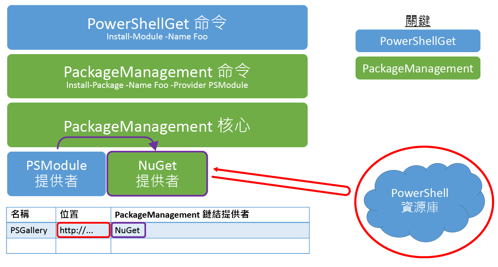

# 常見問題集Frequently Asked Questions

## 什麼是 PowerShell 模組？What is a PowerShell module?

PowerShell 模組是包含一些 PowerShell 功能的可重複使用套件。A PowerShell module is a reusable package containing some PowerShell functionality. PowerShell 中的所有項目 (函數、變數、DSC 資源等) 都可以封裝成模組。Everything in PowerShell (functions, variables, DSC resources, etc.) can be packaged in modules. 通常，模組是資料夾，內含特定路徑上所儲存的特定檔案類型。Typically, modules are folders containing specific types of files stored on a specific path. 這裡有數種不同類型的 PowerShell 模組。There are a few different types of PowerShell modules out there.

## 什麼是 PowerShell 指令碼？What is a PowerShell script?

PowerShell 指令碼是儲存在 .ps1 檔案中的一系列命令，可啟用重複使用和共用。A PowerShell script is a series of commands that are stored in a .ps1 file to enable reuse and sharing. PowerShell 工作流程也是 PowerShell 指令碼，可概述一組工作並提供這些工作的序列。PowerShell workflows are also PowerShell scripts, which outline a set of tasks and provide sequencing for those tasks. 如需詳細資訊，請參閱[開始使用 PowerShell 工作流程](https://technet.microsoft.com/library/jj134242.aspx)。For more information, please visit [Getting Started with PowerShell Workflow](https://technet.microsoft.com/library/jj134242.aspx).

## PowerShell 指令碼與 PowerShell 模組的差異為何？How are PowerShell Scripts different from PowerShell Modules?

模組一般最適合用於共用，但是我們將啟用指令碼共用，讓您更輕鬆地將工作流程和指令碼提供給社群。Modules are generally better for sharing, but we are enabling script sharing to make it easier for you to contribute workflows and scripts to the community. 如需詳細資訊，請參閱下列部落格︰For more information, see the following blogs:

- [不要撰寫指令碼，撰寫 PowerShell 模組Don't Write Scripts, Write PowerShell Modules](https://blogs.technet.microsoft.com/heyscriptingguy/2011/06/27/dont-write-scripts-write-powershell-modules/)
- [了解 PowerShell 模組Understanding PowerShell Modules](https://blogs.technet.microsoft.com/heyscriptingguy/2015/07/10/understanding-powershell-modules/)

## 如何發行至 PowerShell 資源庫？How can I publish to the PowerShell Gallery?

您必須在 PowerShell 資源庫中註冊帳戶，才能將項目發行至資源庫。You must register an account in the PowerShell Gallery before you can publish items to the Gallery. 原因是發行項目需要註冊時所提供的 NuGetApiKey。This is because publishing items requires a NuGetApiKey, which is provided upon registration. 若要註冊，請使用您的個人、工作或學校帳戶登入 PowerShell 資源庫。To register, use your personal, work, or school account to sign in to the PowerShell Gallery. 第一次登入時，需要單次註冊程序。A one-time registration process is required when you sign in for the first time. 之後，就可以在設定檔頁面上使用 NuGetApiKey。Afterwards, your NuGetApiKey is available on your profile page.

您在資源庫中進行註冊之後，請使用 [Publish-Module](https://go.microsoft.com/fwlink/?LinkID=760387&clcid=0x409) 或 [Publish-Script](https://go.microsoft.com/fwlink/?LinkID=760387&clcid=0x409) Cmdlet 將您的項目發行至資源庫。Once you have registered in the Gallery, use the [Publish-Module](https://go.microsoft.com/fwlink/?LinkID=760387&clcid=0x409) or [Publish-Script](https://go.microsoft.com/fwlink/?LinkID=760387&clcid=0x409) cmdlets to publish your item to the Gallery. 如需如何執行這些 Cmdlet 的詳細資訊，請瀏覽 [發行] 索引標籤，或閱讀 [Publish-Module](https://go.microsoft.com/fwlink/?LinkID=760387&clcid=0x409) 和 [Publish-Script](https://go.microsoft.com/fwlink/?LinkID=760387&clcid=0x409) 文件。For more details on how to run these cmdlets, visit the Publish tab, or read the [Publish-Module](https://go.microsoft.com/fwlink/?LinkID=760387&clcid=0x409) and [Publish-Script](https://go.microsoft.com/fwlink/?LinkID=760387&clcid=0x409) documentation.

**您不需要註冊或登入資源庫，就可以安裝或儲存項目。****You do not need to register or sign in to the Gallery to install or save items.**

## 我收到『無法處理要求。I received "Failed to process request. 「指定的 API 金鑰無效，或沒有存取所指定套件的權限。」。'The specified API key is invalid or does not have permission to access the specified package.'. 遠端伺服器傳回錯誤：(403) 已禁止。』The remote server returned an error: (403) Forbidden." 錯誤 (當我嘗試將項目發行至 PowerShell 資源庫時)。error when I tried to publish an item to the PowerShell Gallery. 這是什麼意思？What does that mean?

下列原因會發生此錯誤：This error can occur for the following reasons:

- **指定的 API 金鑰無效。****The specified API key is invalid.**
     請確定您已透過帳戶指定有效的 API 金鑰。Ensure that you have specified the valid API key from your account. 若要取得您的 API 金鑰，請檢視設定檔頁面。To get your API key, view your profile page.
- **指定的項目名稱不屬於您。****The specified item name is not owned by you.**
     如果您已確認 API 金鑰正確，則可能已有與您嘗試使用之項目同名的項目。If you have confirmed that your API key is correct, then there may already exist an item with the same name as the one you are trying to use. 擁有者可能未列出項目，在此情況下，它不會出現在任何搜尋結果中。The item may have been unlisted by the owner, in which case it will not appear in any search results. 若要判斷是否已有同名的項目，請開啟瀏覽器，並瀏覽至項目的詳細資料頁面：`https://www.powershellgallery.com/packages/<itemName>`。To determine if an item with the same name already exists, open a browser and navigate to the item's details page: `https://www.powershellgallery.com/packages/<itemName>`. 例如，直接瀏覽至 `https://www.powershellgallery.com/packages/pester` 會將您帶往 Pester 模組的詳細資料頁面 (不論是否列出)。For example, navigating directly to `https://www.powershellgallery.com/packages/pester` will take you to the Pester module's details page, whether it is unlisted or not. 如果已有具有衝突名稱的項目，而且未列出，則可以︰If an item with a conflicting name already exists and is unlisted, you can:
    - 為您的項目選取另一個名稱。Select another name for your item.
    - 連絡現有項目的擁有者。Contact the owners of the existing item.

## 為什麼無法使用我的個人帳戶登入，但我昨天還可以登入？Why can't I sign in with my personal account, but I could sign in yesterday?

請注意，組件庫帳戶無法容納主要電子郵件別名的變更。Please be aware that your gallery account does not accommodate changes to your primary email alias. 如需詳細資訊，請參閱[管理您 Microsoft 帳戶上的別名](https://windows.microsoft.com/windows/outlook/add-alias-account)。For more information, see [Microsoft Email Aliases](https://windows.microsoft.com/windows/outlook/add-alias-account).

## 選取 [項目] 索引標籤上的所有 [類別] 核取方塊時，為什麼看不到所有組件庫項目？Why don't I see all the gallery items when I select all the Category checkboxes on the Items tab?

選取一個 [類別] 核取方塊，即表示「我想要查看這個類別的所有項目」。By selecting a Category checkbox, you are stating "I would like to see all items in this category." 只會顯示所選取類別中的項目。Only the items in the selected categories will be displayed. 同樣地，選取所有 [類別] 核取方塊，即表示「我想要查看任何類別的所有項目」。So similarly, by selecting all the Category checkboxes, you are stating "I would like to see all items in any category." 但是，組件庫中的某些項目不屬於任何列出的類型，因此不會出現在結果中。But some items in the gallery do not belong to any of the categories listed, so they will not appear in the results. 若要查看組件庫中的所有項目，請取消核取所有 [類別]，或再次選取 [項目] 索引標籤。To see all items in the gallery, uncheck all the Categories, or select the Items tab again.

## 將模組發行至 PowerShell 資源庫的需求為何？What are the requirements to publish a module to the PowerShell Gallery?

任何一種 PowerShell 模組 (指令碼模組、二進位模組或資訊清單模組) 都可以發行至組件庫。Any kind of PowerShell module (script modules, binary modules, or manifest modules) can be published to the gallery. 若要發行模組，PowerShellGet 需要知道它的一些事項：版本、描述、作者和授權方式。To publish a module, PowerShellGet needs to know a few things about it - the version, description, author, and how it is licensed. 會從「模組資訊清單」(.psd1) 檔案或從 [**Publish-Module**](https://go.microsoft.com/fwlink/?LinkID=760387&clcid=0x409) Cmdlet 的 **LicenseUri** 參數值中讀取這項資訊，作為發行程序的一部分。This information is read as part of the publishing process from the *module manifest* (.psd1) file, or from the value of the [**Publish-Module**](https://go.microsoft.com/fwlink/?LinkID=760387&clcid=0x409) cmdlet's **LicenseUri** parameter. 所有發行至資源庫的模組都必須具有模組資訊清單。All modules published to the Gallery must have module manifests. 任何在資訊清單中包含下列資訊的模組都可以發行至資源庫：Any module that includes the following information in its manifest can be published to the Gallery:

- 版本Version
- 描述Description
- 作者Author
- 模組授權條款 URI (為資訊清單之 **PrivateData** 區段的一部分，或在 [**Publish-Module**](https://go.microsoft.com/fwlink/?LinkID=760387&clcid=0x409) Cmdlet 的 **LicenseUri** 參數中)。A URI to the license terms of the module, either as part of the **PrivateData** section of the manifest, or in the **LicenseUri** parameter of the [**Publish-Module**](https://go.microsoft.com/fwlink/?LinkID=760387&clcid=0x409) cmdlet.

## 如何建立格式正確的模組資訊清單？How do I create a correctly-formatted module manifest?

建立模組資訊清單的最簡單方式是執行 [**New-ModuleManifest**](https://go.microsoft.com/fwlink/?LinkID=760387&clcid=0x409) Cmdlet。The easiest way to create a module manifest is to run the [**New-ModuleManifest**](https://go.microsoft.com/fwlink/?LinkID=760387&clcid=0x409) cmdlet. 在 PowerShell 5.0 或更新版本中，New-ModuleManifest 會使用有用中繼資料的空白欄位來產生格式正確的模組資訊清單 (例如 **ProjectUri**、**LicenseUri** 和 **Tags**)。In PowerShell 5.0 or newer, New-ModuleManifest generates a correctly-formatted module manifest with blank fields for useful metadata like **ProjectUri**, **LicenseUri**, and **Tags**. 只要填上空白，或使用產生的資訊清單作為正確格式的範例。Simply fill in the blanks, or use the generated manifest as an example of correct formatting.

若要確認已正確地填入所有必要中繼資料欄位，請使用 [**Test-ModuleManifest**](https://go.microsoft.com/fwlink/?LinkID=760387&clcid=0x409) Cmdlet。To verify that all required metadata fields have been properly filled, use the [**Test-ModuleManifest**](https://go.microsoft.com/fwlink/?LinkID=760387&clcid=0x409) cmdlet.

若要更新模組資訊清單檔案欄位，請使用 [**Update-ModuleManifest**](https://go.microsoft.com/fwlink/?LinkID=760387&clcid=0x409) Cmdlet。To update the module manifest file fields, use the [**Update-ModuleManifest**](https://go.microsoft.com/fwlink/?LinkID=760387&clcid=0x409) cmdlet.

## 將指令碼發行至資源庫的需求為何？What are the requirements to publish a script to the Gallery?

任何一種 PowerShell 指令碼 (指令碼或工作流程) 都可以發行至組件庫。Any kind of PowerShell script (scripts or workflows) can be published to the gallery. 若要發行指令碼，PowerShellGet 需要知道它的一些事項：版本、描述、作者和授權方式。To publish a script, PowerShellGet needs to know a few things about it - the version, description, author, and how it is licensed. 會從指令檔的 *PSScriptInfo* 或從 [**Publish-Script**](https://go.microsoft.com/fwlink/?LinkID=760387&clcid=0x409) Cmdlet 的 **LicenseUri** 參數值中讀取這項資訊，作為發行程序的一部分。This information is read as part of the publishing process from the script file's *PSScriptInfo* section, or from the value of the [**Publish-Script**](https://go.microsoft.com/fwlink/?LinkID=760387&clcid=0x409) cmdlet's **LicenseUri** parameter. 所有發行至資源庫的指令碼都必須具有中繼資料資訊。All scripts published to the Gallery must have metadata information. 任何在 PSScriptInfo 區段中包含下列資訊的指令碼都可以發行至資源庫：Any script that includes the following information in its PSScriptInfo section can be published to the Gallery:

- 版本Version
- 描述Description
- 作者Author
- 指令碼授權條款 URI (為指令碼之 **PSScriptInfo** 區段的一部分，或在 [**Publish-Script**](https://go.microsoft.com/fwlink/?LinkID=760387&clcid=0x409) Cmdlet 的 **LicenseUri** 參數中)。A URI to the license terms of the script, either as part of the **PSScriptInfo** section of the script, or in the **LicenseUri** parameter of the [**Publish-Script**](https://go.microsoft.com/fwlink/?LinkID=760387&clcid=0x409) cmdlet.

## 如何進行搜尋？How do I search?

在文字方塊中，輸入您要尋找的內容。Type what you are looking for in the text box. 例如，如果您想要尋找與 Azure SQL 相關的模組，只需要輸入 "azure sql"。For example, if you want to find modules that are related to Azure SQL, just type "azure sql". 搜尋引擎會在所有已發行的項目 (包含標題、描述和中繼資料) 中尋找這些關鍵字。Our search engine will look for those keywords in all published items, including titles, descriptions and across metadata. 然後，根據加權的品質分數，就會顯示最接近的相符項目。Then, based on a weighted quality score, it will display the closest matches. 您也可以在下列欄位的搜尋查詢中使用 field:"value" 語法，以依特定欄位進行搜尋：You can also search by specific field using field:"value" syntax in the search query for the following fields:

- 標記Tags
- 函式Functions
- CmdletCmdlets
- DscResourcesDscResources
- PowerShellVersionPowerShellVersion

因此，例如，當您搜尋 PowerShellVersion:"2.0" 時，只會顯示與 PowerShellVersion 2.0 相容的結果 (根據模組/指令碼資訊清單)。So, for example, when you search for PowerShellVersion:"2.0" only results that are compatible with PowerShellVersion 2.0 (based on their module/script manifest) will be displayed.

## 如何建立格式正確的指令檔？How do I create a correctly-formatted script file?

建立格式正確之指令檔的最簡單方式是執行 [**New-ScriptFileInfo**](https://go.microsoft.com/fwlink/?LinkID=760387&clcid=0x409) Cmdlet。The easiest way to create a properly-formatted script file is to run the [**New-ScriptFileInfo**](https://go.microsoft.com/fwlink/?LinkID=760387&clcid=0x409) cmdlet. 在 PowerShell 5.0 中，New-ScriptFileInfo 會使用有用中繼資料的空白欄位來產生格式正確的指令檔 (例如 **ProjectUri**、**LicenseUri** 和 **Tags**)。In PowerShell 5.0, New-ScriptFileInfo generates a correctly-formatted script file with blank fields for useful metadata like **ProjectUri**, **LicenseUri**, and **Tags**. 只要填上空白，或使用產生的指令檔作為正確格式的範例。Simply fill in the blanks, or use the generated script file as an example of correct formatting.

若要確認已正確地填入所有必要中繼資料欄位，請使用 [**Test-ScriptFileInfo**](http://go.microsoft.com/fwlink/?LinkID=760387&clcid=0x409) Cmdlet。To verify that all required metadata fields have been properly filled, use the [**Test-ScriptFileInfo**](http://go.microsoft.com/fwlink/?LinkID=760387&clcid=0x409) cmdlet.

若要更新指令碼中繼資料欄位，請使用 [**Update-ScriptFileInfo**](https://go.microsoft.com/fwlink/?LinkID=760387&clcid=0x409) Cmdlet。To update the script metadata fields, use the [**Update-ScriptFileInfo**](https://go.microsoft.com/fwlink/?LinkID=760387&clcid=0x409) cmdlet.

## 是否還有其他類型的 PowerShell 模組？What other types of PowerShell Modules exist?

PowerShell 模組這個詞也是指實作實際功能的檔案。The term PowerShell module also refers to the files that implement actual functionality. 指令碼模組檔案 (.psm1) 包含 PowerShell 程式碼。Script module files (.psm1) contain PowerShell code. 二進位模組檔案 (.dll) 包含已編譯的程式碼。Binary module files (.dll) contain compiled code.

以下是一種考量它的方式：封裝模組的資料夾就是模組資料夾。Here is one way to think about it: the folder that encapsulates the module is the module folder. 模組資料夾可以包含模組資訊清單 (.psd1)，而模組資訊清單描述資料夾的內容。The module folder can contain a module manifest (.psd1) that describes the contents of the folder. 實際執行工作的檔案是指令碼模組檔案 (.psm1) 和二進位模組檔案 (.dll)。The files that actually do the work are the script module files (.psm1) and the binary module files (.dll). DSC 資源位於特定子資料夾中，並且實作為指令碼模組檔案或二進位模組檔案。DSC resources are located in a specific sub-folder, and are implemented as script module files or binary module files.

資源庫中的所有模組都會包含模組資訊清單，而且其中大部分模組都會包含指令碼模組檔案或二進位模組檔案。All of the modules in the Gallery contain module manifests, and most of these modules contain script module files or binary module files. 因為這些不同的意義，所以「模組」這個詞很容易混淆。The term module can be confusing because of these different meanings. 除非明確指定，否則每次在此頁面上使用「模組」這個詞指的都是包含這些檔案的模組資料夾。Unless explicitly stated otherwise, all uses of the word module on this page refer to the module folder containing these files.

## PackageManagement 與 PowerShellGet 的關聯為何？How does PackageManagement relate to PowerShellGet? (高階回答)(High Level Answer)

PackageManagement 是處理任何套件管理員的通用介面。PackageManagement is a common interface for working with any package manager. 最後，不論處理 PowerShell 模組、MSI、Ruby 寶石、NuGet 套件還是 Perl 模組，您應該可以使用 PackageManagement 的命令 (Find-Package 和 Install-Package) 來進行尋找並安裝。Eventually, whether you're dealing with PowerShell modules, MSIs, Ruby gems, NuGet packages, or Perl modules, you should be able to use PackageManagement's commands (Find-Package and Install-Package) to find and install them. PackageManagement 的做法是具有插入 PackageManagement 之每個套件管理員的套件提供者。PackageManagement does this by having a package provider for each package manager that plugs into PackageManagement. 提供者會執行所有實際工作；他們會從存放庫提取內容，並將內容安裝在本機。Providers do all of the actual work; they fetch content from repositories, and install the content locally. 套件提供者通常只需要包裝所指定套件類型的現有套件管理員工具。Often, package providers simply wrap around the existing package manager tools for a given package type.

PowerShellGet 是 PowerShell 項目的套件管理員。PowerShellGet is the package manager for PowerShell items. 具有可透過 PackageManagement 公開 PowerShellGet 功能的 PSModule 套件提供者。There is a PSModule package provider that exposes PowerShellGet functionality through PackageManagement. 因此，您可以執行 [Install-Module](https://go.microsoft.com/fwlink/?LinkID=760387&clcid=0x409) 或 Install-Package -Provider PSModule 以從 PowerShell Gallery 安裝模組。Because of this, you can either run [Install-Module](https://go.microsoft.com/fwlink/?LinkID=760387&clcid=0x409) or Install-Package -Provider PSModule to install a module from the PowerShell Gallery. 無法透過 PackageManagement 命令存取特定 PowerShellGet 功能 (包含 [Update-Module](https://go.microsoft.com/fwlink/?LinkID=760387&clcid=0x409) 和 [Publish-Module](https://go.microsoft.com/fwlink/?LinkID=760387&clcid=0x409))。Certain PowerShellGet functionality, including [Update-Module](https://go.microsoft.com/fwlink/?LinkID=760387&clcid=0x409) and [Publish-Module](https://go.microsoft.com/fwlink/?LinkID=760387&clcid=0x409), cannot be accessed through PackageManagement commands.

總而言之，PowerShellGet 只著重於具有 PowerShell 內容的高階套件管理體驗。In summary, PowerShellGet is solely focused on having a premium package management experience for PowerShell content. PackageManagement 著重於透過一組通用工作來公開所有套件管理體驗。PackageManagement is focused on exposing all package management experiences through one general set of tools. 如果您不滿意這個回答，則在本文件底端的 **PackageManagement 實際上與 PowerShellGet 的關聯為何？**一節中會有較長的回答。If you find this answer unsatisfying, there is a long answer at the bottom of this document, in the **How does PackageManagement actually relate to PowerShellGet?** section.

如需詳細資訊，請瀏覽 [PackageManagement 專案頁面](https://oneget.org/)。For more information, please visit the [PackageManagement project page](https://oneget.org/).

## NuGet 與 PowerShellGet 的關聯為何？How does NuGet relate to PowerShellGet?

PowerShell 資源庫是修改過的 [NuGet Gallery](https://www.nuget.org/) 版本。The PowerShell Gallery is a modified version of the [NuGet Gallery](https://www.nuget.org/). PowerShellGet 使用 NuGet 提供者來處理 NuGet 型存放庫 (例如 PowerShell 資源庫)。PowerShellGet uses NuGet provider to work with NuGet based repositories like the PowerShell Gallery.

您可以對任何有效的 NuGet 存放庫或檔案共用使用 PowerShellGet。You can use PowerShellGet against any valid NuGet repository or file share. 您只需要執行 [**Register-PSRepository**](https://go.microsoft.com/fwlink/?LinkID=760387&clcid=0x409) Cmdlet，即可新增存放庫。You simply need to add the repository by running the [**Register-PSRepository**](https://go.microsoft.com/fwlink/?LinkID=760387&clcid=0x409) cmdlet.

## 是否表示我可以使用 NuGet.exe 來處理 Gallery？Does that mean I can use NuGet.exe to work with the Gallery?

可以。Yes.

## PackageManagement 實際上與 PowerShellGet 的關聯為何？How does PackageManagement actually relate to PowerShellGet? (技術詳細資料)(Technical Details)

其實，PowerShellGet 大量採用 PackageManagement 基礎結構。Under the hood, PowerShellGet heavily leverages PackageManagement infrastructure.

在 PowerShell Cmdlet 層，[Install-Module](https://go.microsoft.com/fwlink/?LinkID=760387&clcid=0x409) 實際上是 Install-Package -Provider PSModule 的精簡型包裝函式。At the PowerShell cmdlet layer, [Install-Module](https://go.microsoft.com/fwlink/?LinkID=760387&clcid=0x409) is actually a thin wrapper around Install-Package -Provider PSModule.

在 PackageManagement 套件提供者層，PSModule 套件提供者實際上會呼叫其他 PackageManagement 套件提供者。At the PackageManagement package provider layer, the PSModule package provider actually calls into other PackageManagement package providers. 例如，當您處理 NuGet 型組件庫 (例如 PowerShell Gallery) 時，PSModule 套件提供者會使用 NuGet 套件提供者來處理存放庫。For example, when you are working with NuGet-based galleries (such as the PowerShell Gallery), the PSModule package provider uses the NuGet Package Provider to work with the repository.

圖 1：PowerShellGet 架構Figure 1: PowerShellGet Architecture

## 執行 PowerShellGet 所需的項目為何？What is required to run PowerShellGet?

一般建議挑選最新版本的 PowerShellGet 模組 (請注意，需要 .NET 4.5)。In general we recommend picking the latest version of PowerShellGet module (note that it requires .NET 4.5).

**PowerShellGet** 模組需要 **PowerShell 3.0 或更新版本**。The **PowerShellGet** module requires **PowerShell 3.0 or newer**.

因此，**PowerShellGet** 需要下列其中一個作業系統：Therefore, **PowerShellGet** requires one of the following operating systems:

- Windows 10Windows 10
- Windows 8.1 專業版Windows 8.1 Pro
- Windows 8.1 EnterpriseWindows 8.1 Enterprise
- Windows 7 SP1Windows 7 SP1
- Windows Server 2016Windows Server 2016
- Windows Server 2012 R2Windows Server 2012 R2
- Windows Server 2008 R2 SP1Windows Server 2008 R2 SP1

**PowerShellGet** 也需要 .NET Framework 4.5 或更新版本。**PowerShellGet** also  requires .NET Framework 4.5 or above. 您可以從[這裡](https://msdn.microsoft.com/library/5a4x27ek.aspx)安裝 .NET Framework 4.5 或更新版本。You can install .NET Framework 4.5 or above from [here](https://msdn.microsoft.com/library/5a4x27ek.aspx).

## 是否可以保留未來發行之項目的名稱？Is it possible to reserve names for items that will be published in future?

無法擅自使用項目名稱。It is not possible to squat item names. 如果您認為現有項目已採用更符合您項目的名稱，請嘗試[連絡項目的擁有者](psgallery_contacting_item_owners.md)。If you feel that an existing item has taken the name which suits your item more, try [contacting the owner of the item](psgallery_contacting_item_owners.md). 如果您在幾週內未收到回應，則可以連絡支援人員，PowerShell Gallery 小組會查看該問題。If you didnt get response within a couple of weeks, you can contact support and the PowerShell Gallery team will look in to it.

## 如何宣告項目的擁有權？How do I claim ownership for items ?

如需詳細資訊，請參閱 [PowerShellGallery.com 上的管理項目擁有者](Managing-Item-Owners.md)。Check out [Managing Item Owners on PowerShellGallery.com](Managing-Item-Owners.md) for details.

## 如何對待違反我的項目授權的項目擁有者？How do I deal with an item owner who is violating my item license?

建議 PowerShell 社群一起合作，來解決任何可能在項目擁有者與其他項目之擁有者間發生的爭議。We encourage the PowerShell community to work together to resolve any disputes that may arise between item owners and the owners of other items.  在 PowerShellGallery.com 系統管理員調解之前，您需要遵循我們所建立的[爭端解決程序](psgallery_dispute_resolution.md)。We have crafted a [dispute resolution process](psgallery_dispute_resolution.md) that we ask you to follow before PowerShellGallery.com administrators intercede.

