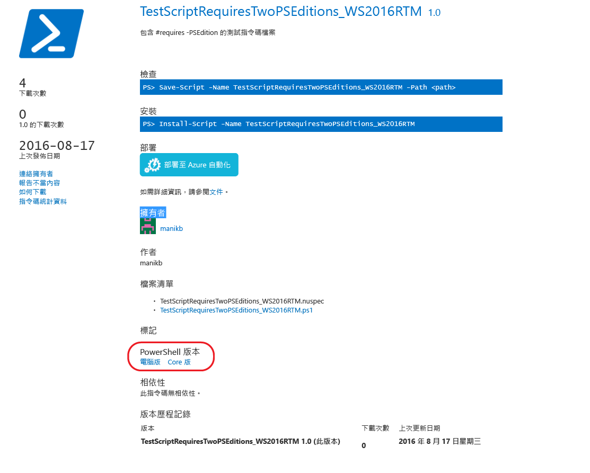
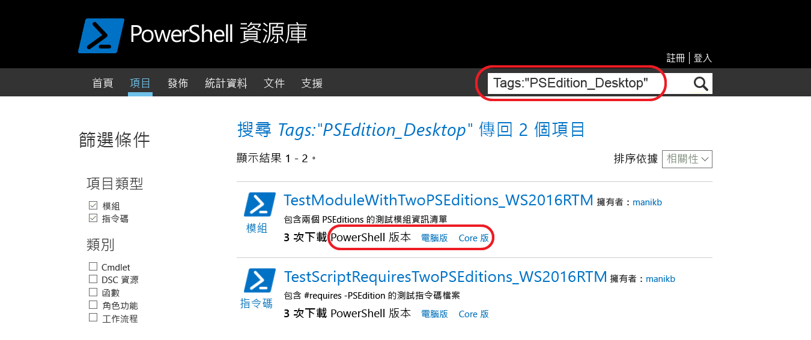

# 具有相容 PowerShell 版本的項目Items with compatible PowerShell Editions
從 5.1 版開始，PowerShell 提供代表各種功能集及平台相容性的不同版本。Starting with version 5.1, PowerShell is available in different editions which denote varying feature sets and platform compatibility.

- **Desktop Edition︰**建置在 .NET Framework 上，與在完整使用量的 Windows 版本 (如 Server Core 和 Windows Desktop) 上執行之 PowerShell 版本的指令碼和模組相容。**Desktop Edition:** Built on .NET Framework and provides compatibility with scripts and modules targeting versions of PowerShell running on full footprint editions of Windows such as Server Core and Windows Desktop.
- **Core Edition︰**建置在 .NET Core 上，與在降低使用量的 Windows 版本 (如 Nano Server 和 Windows IoT) 上執行之 PowerShell 版本的指令碼和模組相容。**Core Edition:** Built on .NET Core and provides compatibility with scripts and modules targeting versions of PowerShell running on reduced footprint editions of Windows such as Nano Server and Windows IoT.

## PowerShell Gallery 會擷取支援的 PSEditions 中繼資料，並可讓您篩選與特定 PowerShell 版本相容的項目。PowerShell Gallery extracts supported PSEditions metadata and allows you to filters the items compatible for specific PowerShell Editions

如果項目已指定相容的 PSEditions，則 PSEditions 會列為項目顯示頁面和項目結果中「PowerShell 版本」的一部分。If an item has compatible PSEditions specified, they will be listed as part of 'PowerShell Editions' in the item display page and also in items results.

## 搜尋組件庫 UI 中適用於 PowerShellCore 的項目Search for items in the gallery UI which works on PowerShellCore
使用 Tags:"PSEdition_Desktop" 和 Tags:"PSEdition_Core" 篩選 PowerShell Gallery 上的項目。Use Tags:"PSEdition_Desktop" and Tags:"PSEdition_Core" to filters the items on PowerShell Gallery.

### 使用 Tags:"PSEdition_Core" 搜尋與 PowerShell Core 版本相容的項目。Use Tags:"PSEdition_Core" to search items compatible with PowerShell Core Edition.

### 使用 Tags:"PSEdition_Desktop" 搜尋與 PowerShell Desktop 版本相容的項目。Use Tags:"PSEdition_Desktop" to search items compatible with PowerShell Desktop Edition.

## 撰寫和尋找與 PowerShell 版本相容之項目的詳細資訊More details on authoring and finding the items with compatible PowerShell Editions
### [PSEditions 的模組Modules with PSEditions](../psget/module/modulewithpseditionsupport.md)
### [搭配 PSEditions 的指令碼Scripts with PSEditions](../psget/script/scriptwithpseditionsupport.md)